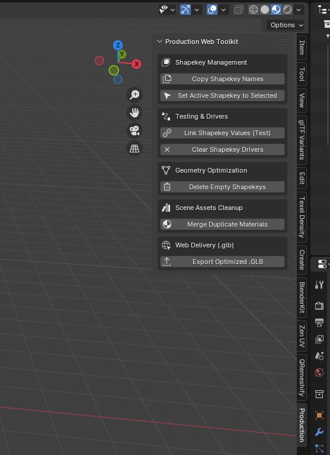

# Blender-Production-Shapekey-Web-Exporter
Comprehensive Blender toolkit for shapekeys matching, testing drivers, material merging, and clean glTF/GLB web-export optimization.
# Production Shapekey & Web Exporter (Blender 4.x & 5.x)

A comprehensive pipeline toolkit for Blender designed to handle multi-mesh shapekey management, active cross-mesh selection, live driver-driven animation testing, material deduplication, and streamlined glTF/GLB web-export optimization with a single click.

---

## 🌟 Key Features

* 🛠️ **Shapekey & Mesh Management**
  * **Copy Shapekey Names:** Instantly mirror structural shapekey lists from your active object to all other selected meshes in a complex assembly, without destroying existing data.
  * **Sync Active Shapekey:** Select a single shapekey name to activate it across all selected meshes simultaneously. This allows for quick, unified cross-mesh shapekey editing and previewing across complex mechanical rigs or modular models.

* 🔗 **Testing & Drivers Pipeline (Blender 4.x & 5.x Ready)**
  * **Link Shapekey Values (Test):** Automatically connect matching shapekeys from separate meshes to your main controller object via stable Blender Drivers. Perfect for real-time visual synchronization testing of multi-mesh objects that transform or change shape together.
  * **Clear Shapekey Drivers:** Instantly purge testing drivers from all selected objects with a single click, preparing your asset for a 100% clean production-ready state.

* 📉 **Web & glTF Optimization**
  * **Delete Empty Shapekeys:** Scans your meshes and safely deletes shapekeys that do not deform any vertices relative to the Basis key. This shrinks your `.gltf`/`.glb` file sizes dramatically!
  * **Merge Duplicate Materials:** Automatically finds and resolves dot-suffixed duplicate materials (e.g., `metal.001`, `metal.002`), remapping them to the original data block and deleting the clutter. Say goodbye to the notorious glTF image data export crashes!
  * **Direct GLB Export:** Bypass the tedious multi-step Top Header Menu (`File > Export > glTF 2.0`). Clicking the button in the N-panel instantly opens the native Blender File View window for the glTF/GLB export, allowing you to choose the save directory, rename the asset, and tweak profile settings on the fly.

---

## 📦 How to Install

1. Download the `production_shapekey_exporter.py` file from this repository.
2. In Blender, go to **Edit > Preferences > Add-ons**.
3. Click **Install...** at the top right and select the downloaded `.py` file.
4. Check the box next to **"Object: Production Shapekey & Web Exporter"** to enable it.
5. Open the **3D Viewport**, press **N** on your keyboard, and locate the **Production** tab.
